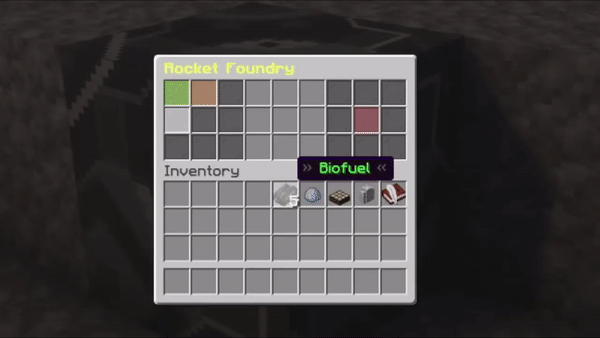
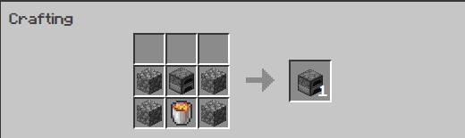
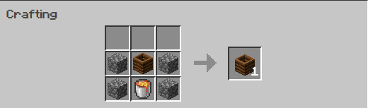
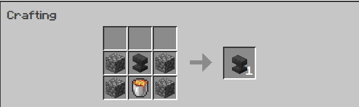
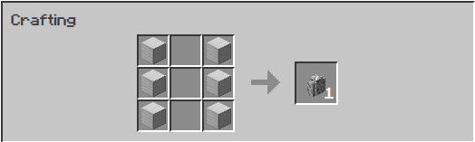
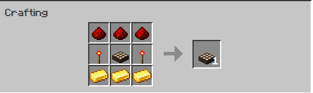

## Overview
A Minecraft plugin that adds nuclear missiles to your Spigot server.  
RealRockets adds a collection of new mechanics to Minecraft. After collecting enough **Enriched Ore**, you can refine it into **Ore Chunks**, which can be crafted into deadly missile warheads. **Enriched Ore** is dropped when mining common stone blocks in the Overworld.

## How to Use
1. Collect up a good amount of **Enriched Ore**
2. Build an **Ore Refinery** and a **Biodiesel Reactor**
3. Use the **Biodiesel Reactor** to create **Biofuel**. To do this, you'll need to combine **Potatoes, Bone Meal, and Sugar Cane**
4. Place the **Biofuel** and **Enriched Ore** into the **Ore Refinery** to create **chunks**
5. You'll need **9 similar chunks** in order to create a **Warhead**. You can do this by crafting a **Warhead Forge**
6. A rocket without a **Targeting Computer** can't navigate, so be sure to craft one of these, too.
7. Craft a **Rocket Hull** to put all the items in
8. Inside a **Rocket Foundry**, combine your **Rocket Hull**, **Warhead**, and **Targeting Computer** and build the rocket
9. Write down your target coordinates in a Book & Quill. Then, place both the rocket and the book inside the foundry, and **Set Target**
10. A rocket needs fuel, so be sure to add some **Biofuel** for the trip. **1 Biofuel** flies about **50 blocks**
11. When your rocket is ready to launch, prime it in the foundry
12. From a safe location, place the rocket on the ground. It will launch, fly to the destination, and detonate. Congrats!

### Key Ingredients
**Biofuel**  
Craft Biofuel in a Biodiesel Reactor by combining **Sugar Cane, Potatoes, and Bone Meal**.

**Chunks**  
Create various ore Chunks in an **Ore Refinery** by combining **Enriched Ore** and **Biofuel**.

**Warheads**  
Missile warheads are made in a **Warhead Forge** by supplying 9 of any one kind of **Chunk**.

**Missiles**  
Missiles are made in the **Rocket Foundry**. You need a **Warhead**, a **Rocket Hull**, and **Biofuel** to fly. However, your missile won't know where to go without a **Targeting Computer**, so be sure to include one when you craft your missile! Targeting Computers enable you to change the missile's target before it has been primed. To do this, simply write down the **coordinates** in a **Book & Quill**, and use the **Rocket Foundry** to set the target.

### Crafting Recipes
**Ore Refinery**  

**Biodiesel Reactor**  

**Warhead Forge**  

**Rocket Foundry**  

**Rocket Hull**  

**Targeting Computer**  

### Commands
/rr  
/realrockets

### Permissions
realrockets.use - Use the command and get one of each RealRockets block  
realrockets.dropore - Allow the player to drop ore when mining

## Installation (Server)
To use the plugin, simply download a `.jar` binary from the [Releases](https://github.com/hwdotexe/RealRockets/releases) page for your server's version, and restart.

## Installation (Development)
If you'd like to install the codebase and make changes, simply follow these instructions:

### Step 1: Clone
In a terminal, use `git clone https://github.com/hwdotexe/RealRockets.git`

### Step 2: Import as a Maven Project
This plugin uses Maven as its build system. As such, you'll need to import it using Maven as well. This process varies by IDE, so please seek out their instructions if needed.

### Step 3: Building
When you're ready to compile the plugin locally, you can use `mvn clean package` to generate your `.jar` file. 

## Contributing
If you like this plugin and want to contribute, please do! I welcome any and all Pull Requests from eager developers who want to help out. 
